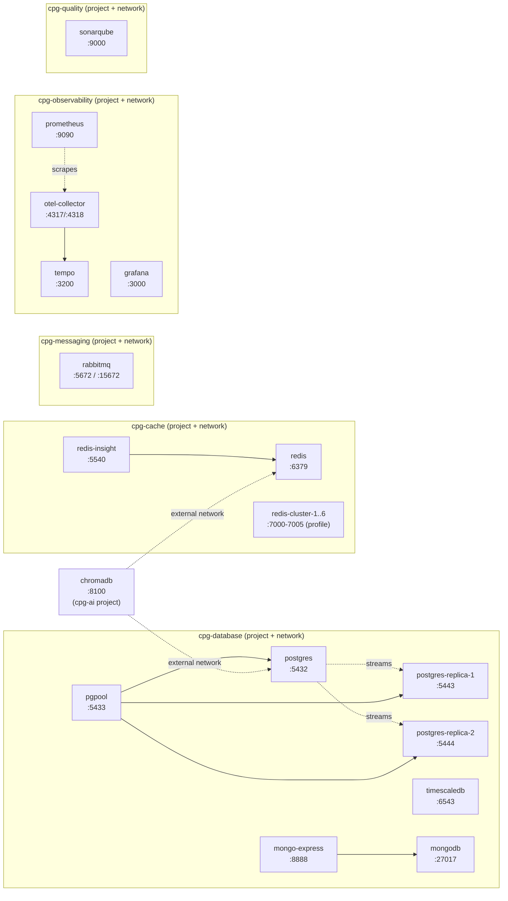

# compose-playground

A local dev "everything box" - Postgres (with real primary/replica streaming
replication + round-robin read routing), Redis (single-node and a real 6-node
Cluster), RabbitMQ, MongoDB, TimescaleDB, a full observability stack
(OpenTelemetry + Tempo + Prometheus + Grafana), SonarQube, and ChromaDB.

Each group of services is its own **docker-compose project**, isolated on its
own Docker network, startable/stoppable independently - and controllable as a
whole or group-by-group from one friendly interactive CLI (`cpg`).

Built to test infra patterns (replication, clustering, read routing, network
segmentation) against the real thing locally, instead of mocking them.

## Install

Gives you a `cpg` command usable from **any directory, any shell**. No
`git clone` needed first - the one-liner does that for you (into
`~/compose-playground` by default; override with `$COMPOSE_PLAYGROUND_DIR` /
`$env:COMPOSE_PLAYGROUND_DIR` before running it).

**Windows (PowerShell):**
```powershell
irm https://raw.githubusercontent.com/ndri-nr/compose-playground/main/install-remote.ps1 | iex
```

**Git Bash / Linux / macOS:**
```bash
curl -fsSL https://raw.githubusercontent.com/ndri-nr/compose-playground/main/install-remote.sh | bash
```

Already have the repo cloned? Just run `./install.sh` (or `./install.ps1`)
from inside it instead - same result, skips the clone/pull step.

Open a new terminal afterwards if the installer says it updated your PATH.
Then from anywhere:

```
cpg
```

Uninstalling: delete `cpg` / `cpg.cmd` from `~/.local/bin` (remove that folder
from PATH if you added it just for this), then remove the cloned folder
(`~/compose-playground` by default).

## The `cpg` CLI

Run it bare to drop into an interactive shell - like `claude`'s own REPL:

```
$ cpg
cpg interactive shell. /help buat commands, /exit buat keluar.

GROUP            STATUS
database         [7/7 running]  postgres postgres-replica-1 postgres-replica-2 pgpool timescaledb mongodb mongo-express
cache            [8/9 running]  redis redis-insight redis-cluster-1 ...
...

cpg> /stop cache
==> docker compose -f compose/cache.yml stop redis redis-insight ...

cpg> /start database
...

cpg> /exit
Bye.
```

Or run one-shot from a normal shell:

```
cpg status             # every group + running/total count, color-coded
cpg status cache       # just one group
cpg start [group]      # no group -> pick from what's not fully up yet
cpg stop  [group]      # no group -> pick from what's actually running
cpg restart [group]
cpg help
```

Forgiving input everywhere (shell or one-shot): case-insensitive, understands
aliases (`db`, `redis`, `rabbit`, `obs`, `sonar`, `chroma`, `up`/`down`, ...),
unique prefixes (`obs` -> `observability`), and asks "did you mean X?" on a
close typo instead of just failing.

If you didn't install it globally, run it straight from the repo instead:
`./docker-group.sh ...` or `./docker-group.ps1 ...`.

## Quick start (without `cpg`)

Each group is a separate compose file/project:

```bash
docker compose -f compose/database.yml up -d                        # postgres, timescaledb, mongodb
docker compose -f compose/database.yml --profile postgres-replica up -d  # + 2 replicas + pgpool
docker compose -f compose/cache.yml up -d                            # redis
docker compose -f compose/cache.yml --profile redis-cluster up -d    # + 6-node Redis Cluster
docker compose -f compose/messaging.yml up -d
docker compose -f compose/observability.yml up -d
docker compose -f compose/quality.yml up -d
docker compose -f compose/ai.yml up -d                                # needs database + cache already up (see Architecture)
```

First time only, Postgres replication needs a role created manually (the
volume is pre-initialized, so the usual init-script trick doesn't fire - see
the comment above the `postgres` service in `compose/database.yml`):

```bash
docker compose -f compose/database.yml exec postgres psql -U admin -d sample -c \
  "CREATE ROLE repl_user WITH REPLICATION LOGIN PASSWORD 'repl_password';"
```

## Architecture

Every group is its own compose **project** (`name:` in each file) - run
`docker compose ls` and you'll see 6 separate entries, which is also what
shows up as 6 separate collapsible groups in Docker Desktop's Containers tab
(Docker Desktop groups by project, not by any label - splitting into separate
projects is what actually gets you that grouping, a single multi-network
compose file cannot).

Each project also gets its own Docker network, named to match (`cpg-database`,
`cpg-cache`, ...) - a container in `quality` genuinely cannot resolve a
container in `database`. The one exception is `chromadb` (`ai` project): it
needs both Postgres and Redis, so it attaches directly to `cpg-database` and
`cpg-cache` as **external networks** instead of getting its own. Cross-project
`depends_on` isn't a thing in Compose, so there's no automatic start ordering
for that - `cpg start ai` (or `up -d` via the CLI) auto-starts `database` and
`cache` first if their networks don't exist yet. Starting `compose/ai.yml`
directly with plain `docker compose up -d` will fail with "network
cpg-database not found" unless those two are already up.



## Services

| Group | Service | Port(s) | Notes |
|---|---|---|---|
| Database | `postgres` | 5432 | Always on. Doubles as the replication master. |
| Database | `postgres-replica-1/2` | 5443 / 5444 | `--profile postgres-replica`. Auto-clone via `pg_basebackup`. |
| Database | `pgpool` | 5433 | `--profile postgres-replica`. Round-robin read routing across the replicas; writes go to master. |
| Database | `timescaledb` | 6543 | |
| Database | `mongodb` / `mongo-express` | 27017 / 8888 | |
| Cache | `redis` | 6379 | Single-node. |
| Cache | `redis-cluster-1..6` | 7000-7005 | `--profile redis-cluster`. Real 3 masters + 3 replicas. |
| Cache | `redis-insight` | 5540 | Redis GUI. |
| Messaging | `rabbitmq` | 5672 / 15672 (mgmt UI) | |
| Observability | `otel-collector` | 4317 (gRPC) / 4318 (HTTP) | |
| Observability | `tempo` | 3200 | Traces. |
| Observability | `prometheus` | 9090 | Metrics. |
| Observability | `grafana` | 3000 | Dashboards. |
| Code Quality | `sonarqube` | 9000 | |
| AI / Vector | `chromadb` | 8100 | Attaches to `database` + `cache` networks. |

Default credentials everywhere are `admin` / `password` (RabbitMQ, Mongo,
Postgres, pgpool admin UI) - **these are local-dev placeholders, not meant to
survive contact with anything real.** Change them before pointing this at
anything beyond your own machine.

## Folder layout

```
compose-playground/
├── compose/                    # one compose project per group
│   ├── database.yml
│   ├── cache.yml
│   ├── messaging.yml
│   ├── observability.yml
│   ├── quality.yml
│   └── ai.yml                  # chromadb - external-attaches to database + cache
├── docker-group.sh / .ps1      # the cpg CLI implementation
├── install.sh / .ps1           # installs `cpg` globally
├── postgres/                   # pg_hba.conf + replica bootstrap script
└── observability/              # otel-collector / tempo / prometheus configs
```

## Known quirks

- **`postgres:18.2-alpine3.23`'s baked-in `PGDATA` is `/var/lib/postgresql/18/docker`**,
  not the classic `/var/lib/postgresql/data` every older Postgres image used
  (confirm with `docker inspect postgres:18.2-alpine3.23 --format '{{.Config.Env}}'`).
  Mounting a volume at `/var/lib/postgresql/data` without overriding `PGDATA`
  silently mounts nothing real - Postgres happily initializes fresh data in the
  container's own ephemeral layer instead, and everything *looks* fine until
  the container is ever recreated and all of it is gone. `compose/database.yml`
  sets `PGDATA: /var/lib/postgresql/data` explicitly on the `postgres` service
  for exactly this reason - if you add another Postgres 18+ service, do the
  same and don't trust the image default.
- **`chromadb/chroma:latest` has no healthcheck.** The current image is a bare
  static Rust binary + `dash` - no curl/wget/python/nc inside, and `dash` has
  no `/dev/tcp`, so no HTTP/TCP check is possible without a sidecar.
- **`pgpool` uses `bitnamilegacy/pgpool:latest`**, not `bitnami/pgpool`.
  Bitnami moved older free-tier image tags to the unmaintained `bitnamilegacy`
  repo - no more security updates on these.
- **`repl_user` creation is manual** (see Quick start) since the master's
  volume was already initialized before replication was added - the usual
  `/docker-entrypoint-initdb.d` trick only runs on an empty volume.

## License

MIT - see [LICENSE](LICENSE).
